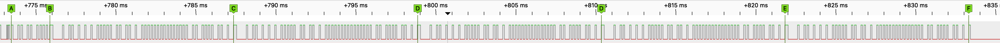
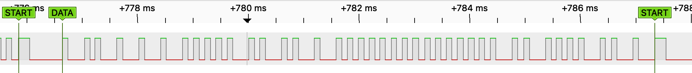
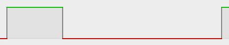
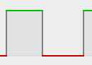
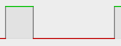
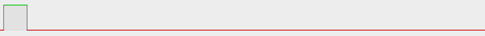

= King-Serry Protocol
:icons: font
ifdef::env-github[:outfilesuffix: .adoc]

The protocol found in link:http://www.king-serry.com/en[Shenzhen King-Serry Electronics Co. Ltd]'s devices. +
The devices of this manufacturer are offered under different names (e.g.: Smernit).

The protocol looks similar to link:https://exploreembedded.com/wiki/NEC_IR_Remote_Control_Interface_with_8051[NEC IR protocol], that's why it is called NEC here.

== Transmission overview

.Full transmission session:

.One packet:

Once a button pressed, the transmitter sends 5 packets of data which is `START` with 40 bits of data.
There are some garbage data bits before first `START`. Transmission ends with `STOP`.

== Symbols

START::
     +
    HIGH: 200µs, LOW: ~580-700 µs

BIT-0::
     +
    HIGH: 100µs, LOW: 100 µs

BIT-1::
     +
    HIGH: 100µs, LOW: 300 µs

STOP::
     +
    HIGH: 100µs, LOW: > 800 µs

== Data

Data bits are:

  +--------------------------------------------------------+--------------------+--------------+
  |         Device ID (24 bits)                            |  Buttons (8 bits)  | CRC (8 bits) |
  +--------------------------------------------------------+--------------------+--------------+

So, for 3-buttons switch:

[cols="<1,^2m", frame=topbot, grid=rows, width=70%]
|===
| 1st button pressed        | 0x2F7702 0x01 0x8C
| 2nd button pressed        | 0x2F7702 0x02 0x88
| 3rd button pressed        | 0x2F7702 0x04 0x80
| 1st + 2nd buttons pressed | 0x2F7702 0x03 0x8C
| 1st + 3rd buttons pressed | 0x2F7702 0x05 0x88
| all three buttons pressed | 0x2F7702 0x07 0x88
|===

[NOTE]
====
You will need very precise RF receiver to reliably read the data.
King-Serry uses CMT2210LB (high-frequency receiver of CMOSTEK) and it seems the signal is parsed
with dedicated microcontroller.
====
